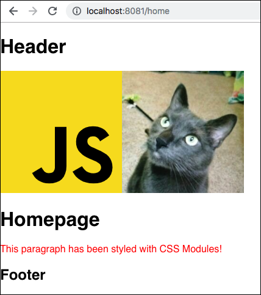

# Static Webpack

A basic Webpack configuration to create simple static sites with Pug/Jade/HTML and SASS/SCSS/CSS.

## Usage

#### Clone

```
git clone https://github.com/CalculoJuridico/static-webpack
```

#### Install Dependencies

```
yarn install
```

#### Running in development

This enables webpack-dev-server for Hot Module Replacement. It also uses browser-sync for a quick way of accessing your site from an external IP. [See more browser-sync options](https://browsersync.io/docs/options).

```
yarn dev
```

#### Running in production

```
yarn build
```

## Project structure

### Pug/Jade -> HTML
You can find pages in `src/views`.
Each page main file is located in `src/views/templates` and the shared elements are in `src/views/includes`.

When **adding a new page** you should add it to the list in `config/pages.config.js` and create the template in `src/views/templates`.

### Referencing images, videos and other media in Pug/Jade/HTML

Images are located in `src/assets/img` and should be required like this:
```pug
img(src=require('img/my-image.jpg'))
```

### Referencing SVG images in Pug/Jade/HTML

This project uses [SVG Sprite Loader](https://www.npmjs.com/package/svg-sprite-loader) to inject SVGs only once in the HTML and reuse them in multiple pages.
Follow these steps to add a SVG image to the project.

1. Add the SVG file to `src/assets/img`. Example: `src/assets/img/logo.svg`
2. Add a import instruction to `main.js` like this:
```js
import logo from 'assets/img/logo.svg';
```
3. On the template file add a require directive in the top of the file.
Then add the the `<svg>` and `<use>` tags where the image should be placed.
Also add a height and/or width since a SVG has no fixed dimensions.
```
- logo = require('img/logo.svg')
...
div
  ...
  svg(viewBox=logo.viewBox width="200")
    use(xlink:href='#' + logo.id)
```


### SASS -> CSS
You can find styles in `src/styles`.

### Referencing images, videos and other media in SASS/SCSS/CSS

Images are located in `src/assets/img` and should be required like this:
```css
.example {
  background-image: url('img/my-image.jpg');
}
```

### Referencing fonts in SASS/SCSS/CSS

Fonts are located in `static/fonts` and should be referenced like this:
```css
@font-face {
  src: url('/fonts/open-sans-regular.woff2') format('woff2');
}
```

### Referencing SVG images in SASS/SCSS/CSS

Please avoid referencing SVG files in CSS files since this disables the possibility of styling its contents.
Also, you might need to add the [SpriteLoaderPlugin](https://www.npmjs.com/package/svg-sprite-loader#extract-configuration) if you decide to go this route.

## Featured Dependencies

Besides browser-sync and webpack-dev-server, this projects ships with some cool dependencies.

-   [postcss-loader](https://github.com/postcss/postcss-loader)
-   [css-mqpacker](https://github.com/hail2u/node-css-mqpacker) (postcss plugin)
-   [normalize.css](https://github.com/necolas/normalize.css/)

## Screenshots

In the example page there are a SVG image and a JPG image. Please read the previous sections to see how to work with them.


